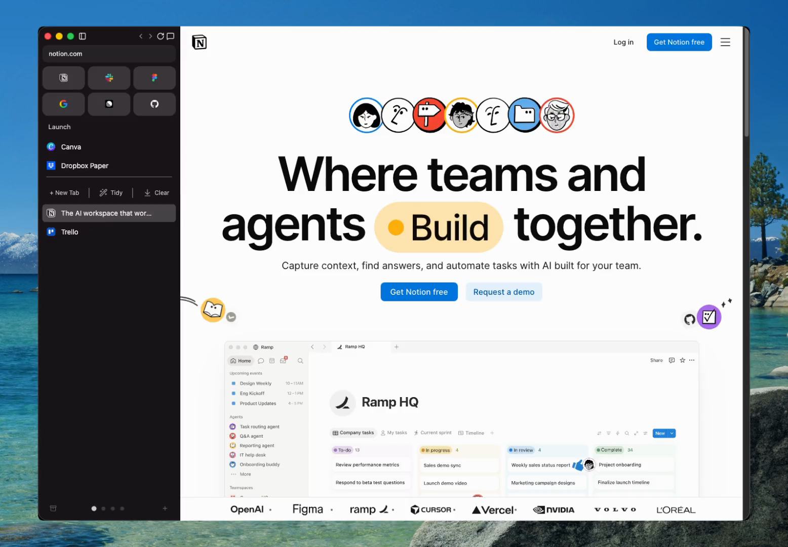

<div align="center">
  

  <h1>Maho</h1>

  <p><strong>A browser that works for you, not on you.</strong></p>

  <p>
    <a href="https://mahobrowser.com">Website</a> ·
    <a href="https://github.com/Project-Maho/maho-browser/issues">Issues</a> ·
    <a href="./CONTRIBUTING.md">Contribute</a> ·
    <a href="./SECURITY.md">Security</a>
  </p>

  <p>
    
    
    
  </p>

  

  <p><a href="./README.zh-CN.md">中文</a> · <a href="./README.ja.md">日本語</a> · English</p>
</div>

---

Most browsers are built to keep you looking at them. Maho is built to get out
of your way.

It organizes your work into **spaces** instead of one endless window, blocks
ads and trackers by default, and puts an AI assistant and your email inside the
browser so you stop switching between apps.

| | |
|---|---|
| **Spaces, not tab sprawl** | Group tabs by what you're doing — work, research, a trip — and switch between them instead of drowning in one flat tab strip. |
| **Ads & trackers off by default** | Built-in blocking, tuned so pages stay readable and fast. No extension roulette. |
| **An assistant that reads the page** | Ask about what you're looking at, summarize it, or run routine work on a schedule — from the browser, not a separate app. |
| **Email in the browser** | Your inbox lives next to your browsing, so checking mail doesn't mean leaving your work. |
| **Your data stays yours** | No telemetry. The client does not phone home, and usage metrics are never sent from the app. Bring your own AI key and keep full control. |

<div align="center">
  
  <p><em>One command bar for search, tab switching, and asking the assistant.</em></p>
</div>

---

## About this source code

This is the **source-available** code for the Maho client: the Chromium overlay
and the Rust crates, WebUI, and native shells that implement Maho's own
features.

It is **not OSI open source.** The [Sustainable Use License](LICENSE) lets you
use and modify the code for your own internal or personal use, and to share it
for free, non-commercially. It does **not** let you sell or host it
commercially, and it does **not** grant rights to the Maho name or logo
([TRADEMARK](TRADEMARK.md)).

- **What's here:** the Chromium overlay (`maho-chromium/`), Rust crates
  (`maho/crates/`), the WebView bundle (`maho/web-ai/`), the mail backend
  (`maho/mail-core/`), and the native shells (`maho/ios-shell/`,
  `maho/android-shell/`).
- **What's not here:** the hosted service (accounts, sync, the AI billing
  proxy, the update feed) and upstream Chromium — you fetch Chromium yourself.

## Build it yourself

You need a Chromium checkout, a Rust toolchain, and your platform's SDK.

```bash
# 1) Fetch upstream Chromium (large), then place this overlay:
ln -s ../../maho-chromium chromium/src/maho

# 2) Build the Rust core the C++ build links against
python3 maho-chromium/build/scripts/build_maho_core.py

# 3) Build
python3 maho-chromium/build/scripts/build_maho.py
```

Builds serialize through a lock (one at a time on purpose), and you should
build the narrowest target that verifies your change. Use **your own** API keys
and OAuth clients for any build you run.

## Contributing

Maho is maintained by a small team and welcomes contributions. Before your
first pull request, sign the CLA and read the
[contribution guide](CONTRIBUTING.md) — a `Signed-off-by` line alone is not
enough. Report security issues **privately** (see [SECURITY.md](SECURITY.md)),
not in public issues.

---

<div align="center">
  <sub>Source-available, not open source. For the product, see <a href="https://mahobrowser.com">mahobrowser.com</a>.</sub>
</div>
