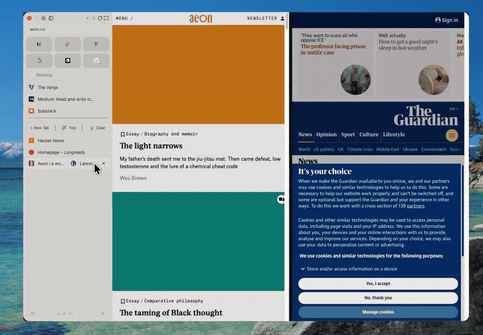
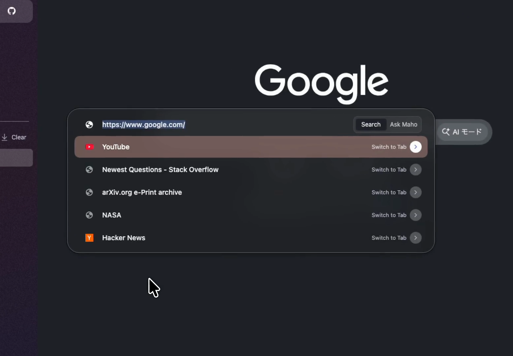

<div align="center">
  

  <h1>Maho</h1>

  <p><strong>为你工作、而不是算计你的浏览器。</strong></p>

  <p>
    <a href="https://mahobrowser.com">官网</a> ·
    <a href="https://github.com/Project-Maho/maho-browser/issues">问题反馈</a> ·
    <a href="./CONTRIBUTING.md">参与贡献</a> ·
    <a href="./SECURITY.md">安全</a>
  </p>

  <p>
    
    
    
  </p>

  

  <p><a href="./README.md">English</a> · <a href="./README.ja.md">日本語</a> · <strong>中文</strong></p>
</div>

---

大多数浏览器是为了让你一直盯着它们而设计的。Maho 则是为了尽量不打扰你。

它把工作整理进**空间（Spaces）**，而不是一个看不到尽头的窗口；默认拦截
广告和跟踪器；并把 AI 助手和你的邮箱内置进浏览器，让你不再来回切换应用。

| | |
|---|---|
| **用空间代替标签页泛滥** | 按你正在做的事（工作、调研、一次旅行）给标签页分组，在它们之间切换，而不是被一条扁平的标签栏淹没。 |
| **默认拦截广告和跟踪器** | 内置拦截，兼顾可读性和速度，不需要折腾各种扩展。 |
| **会读页面的助手** | 直接问你正在看的内容、让它做总结，或把例行工作设为定时执行——就在浏览器里，不用另开应用。 |
| **浏览器里的邮箱** | 收件箱就在你浏览的旁边，查邮件不必离开手头的工作。 |
| **你的数据属于你** | 无遥测。客户端不主动回传，使用数据绝不会从应用发送出去。你也可以自带 AI 密钥，完全掌控。 |

<div align="center">
  
  <p><em>一个命令栏，完成搜索、切换标签页和询问助手。</em></p>
</div>

---

## 关于这份源代码

这是 Maho 客户端的**源码可得（source-available）**代码：实现 Maho 自有功能
的 Chromium 覆盖层，以及 Rust 库、WebUI 和原生外壳。

它**不是 OSI 定义的开源软件**。[Sustainable Use License](LICENSE) 允许你为
自己内部或个人用途使用、修改代码，并以免费、非商业方式分享；但**不允许**
商业出售或托管，也**不**授予 Maho 名称或标志的使用权
（[TRADEMARK](TRADEMARK.md)）。

- **这里有什么：** Chromium 覆盖层（`maho-chromium/`）、Rust 库
  （`maho/crates/`）、WebView 包（`maho/web-ai/`）、邮件后端
  （`maho/mail-core/`），以及原生外壳（`maho/ios-shell/`、
  `maho/android-shell/`）。
- **这里没有什么：** 托管服务（账户、同步、AI 计费代理、更新订阅）和上游
  Chromium——后者需要你自己获取。

## 自己构建

你需要一份 Chromium 检出、Rust 工具链，以及对应平台的 SDK。

```bash
# 1）获取上游 Chromium（体积较大），然后放置本覆盖层：
ln -s ../../maho-chromium chromium/src/maho

# 2）构建 C++ 构建所需的 Rust 核心静态库
python3 maho-chromium/build/scripts/build_maho_core.py

# 3）构建
python3 maho-chromium/build/scripts/build_maho.py
```

构建会通过锁串行化（一次只允许一个，这是有意为之），并建议只构建能验证
你改动的最小目标。自己运行的任何构建都请使用**你自己的** API 密钥和
OAuth 客户端。

## 参与贡献

Maho 由一个小团队维护，欢迎贡献。在提交第一个 pull request 之前，请签署
CLA 并阅读[贡献指南](CONTRIBUTING.md)——仅有 `Signed-off-by` 是不够的。安全
问题请**私下**报告（见 [SECURITY.md](SECURITY.md)），不要发到公开 issue。

---

<div align="center">
  <sub>源码可得，但不是开源。产品请见 <a href="https://mahobrowser.com">mahobrowser.com</a>。</sub>
</div>
